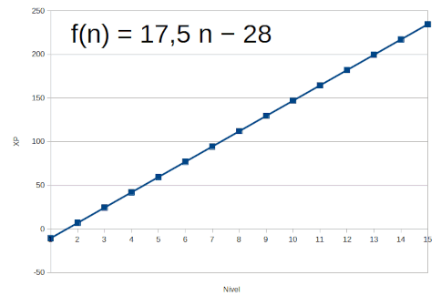

# DAEMON PAPERS #1 — O problema da progressão em nível

> Neste paper pretende-se analisar a "Tabela de Avanço de Nível",
> demonstrando como os requisitos exponenciais de XP para passar de
> nível são incompatíveis com os ganhos lineares de XP. Por fim, propõe
> soluções para o problema.
> 
> 11 de Julho de 2017 (_atualizado dia 2 de Fevereiro de 2024_).
> 
> Daniel Dias Rodrigues ("Nerun")
>
> Publicado em: https://www.gurpzine.com.br/daemon-evoluindo

## Introdução

### Sobre Tabelas de Experiência

Na maioria dos RPGs com evolução de personagens baseada em níveis, a
progressão de nível por ganho de Pontos de Experiência (XP) pode ser do
tipo aritmética, exponencial, logarítmica ou polinomial. E ainda pode
ser mista: misturando mais de um tipo ou mais de uma função do mesmo
tipo para determinadas faixas de níveis.

Na progressão aritmética a quantidade de XP necessária para passar ao
nível seguinte é sempre a mesma a cada nível, formando uma linha reta em
um gráfico, ou seja, progride de forma linear. Na exponencial é cada vez
maior. Na logarítmica ela cresce abruptamente até certo nível e depois
vai se estabilizando num crescimento suave. Na polinomial não há um
padrão, depende da função adotada. Em certos trechos do gráfico
polinomial a progressão pode parecer exponencial no começo e logarítmica
depois, isso porque gráficos polinomiais podem fazer muitas curvas.

No clássico **Dungeons & Dragons** (D&D) -- o RPG que inventou a
evolução por níveis -- cada edição adotou uma fórmula. Do antigo *Rules
Cyclopedia* até o *Advanced Dungeons & Dragons* (1ª e 2ª edições), a
progressão era visivelmente mista: exponencial mais ou menos até o 9º
nível e linear a partir daí. Na 3ª edição a progressão era
exclusivamente polinomial, adotando uma função simples e elegante:

$$\text{XP} = {500 \times {({n^{2} - n})}}$$

Toda essa simplicidade e elegância se perderam nas 4ª e 5ª edições, que
adotaram polinômios de 5º grau ou maior! E nenhuma das funções que se
possa encontrar parece refletir muito bem a tabela de XP adotada pelos
*game designers* da *Wizards of the Coast*.

### Experiência no Daemon

No sistema **Daemon**, a progressão em níveis existe desde a primeira
edição do sistema (Arkanun, 1995; Trevas, 1997), com 10 níveis de
evolução, porém não havia pontos de experiência ou coisa do tipo. Até a
2ª edição era o Mestre quem avaliava o progresso dos personagens e
determinava quando passariam de nível. A evolução por ganho de XP só foi
adotada na 3ª edição, que também acrescentou níveis até o 15º.

> Sempre que uma aventura ou conjunto de aventuras terminar, o Mestre
avalia cada personagem e decide quais estão aptos a aumentar seus níveis
(geralmente a cada três ou quatro aventuras). Não há Pontos de
Experiência ou coisa do tipo. Caso o Mestre decida que um Personagem
aumentou de nível, ele e o jogador devem anotar todas as mudanças na
Ficha de Personagem.
> 
> (Arkanun, 1ª edição, p.50)

> Sempre que uma aventura ou conjunto de aventuras terminar, o Mestre deve
avaliar cada personagem e decidir quais estão aptos a aumentar seus
níveis de conhecimento (geralmente a cada três ou quatro aventuras).
> 
> Caso o Mestre decida que um Personagem aumentou de nível, ele deve se
sentar com o jogador e anotar todas as mudanças em sua ficha de
personagem.
> 
> (Arkanun, 2ª edição, p. 48)

A 3ª edição foi publicada em 2000, com o livro Arkanun, e em 2001 foi
lançado o Trevas. Nesse mesmo período temos o tsunami causado pela
**Open Game License (OGL)** e pelo **Sistema d20**, que liberou
gratuitamente o sistema da 3ª edição de D&D. O impacto foi tão grande
que a Daemon Editora tentou surfar nessa onda e colocou a bendita XP em
sua tabela. **A evolução natural do Sistema Daemon foi atropelada pelo
Sistema d20...**

Seja como for, à primeira vista, a função adotada desde a 3ª edição
parece ser exponencial, seguindo alguma variação da equação básica de
Daemon: Y = K × 2^A÷6, mas não é. A função que melhor representa a
curva de experiência no Sistema Daemon é um polinômio de 5º grau:

$$\frac{n{({56{n^{4} - 883}{n^{3} + 7496}{n^{2} - 6242}{n + 17833}})}}{10000}$$

Onde "*n*" é o nível, e o resultado da equação é a XP necessária para
chegar naquele nível (arredondando). Não que a equação seja relevante
para esta discussão, foi colocada aqui apenas para registro (foi difícil
encontrar!).

## O Problema

O problema está na disparidade na progressão do ganho de XP (distribuída
ao fim de cada aventura) em relação à progressão de nível em si (Tabela
de Avanço de Nível), isto é, **a progressão de nível é polinomial, mas o
ganho de XP é aritmético!** Vamos voltar ao caso D&D para entender isso
melhor.

Como visto, em D&D 3.ed. **a progressão era polinomial**, o que
significa dizer que a XP necessária para passar ao nível seguinte era
sempre maior do que a que foi necessária para chegar ao nível atual. Por
exemplo, para passar do nível 1 ao 2 era preciso 1.000 XP, mas para
passar do nível 2 ao 3 era preciso mais 2.000 (isto é, 3.000 no total),
e do 3 ao 4 eram precisos outros 3.000 XP (6.000 no total), e por aí
vai. Essa progressão só era possível porque os desafios também
aumentavam e as recompensas em XP também: as criaturas que os
personagens enfrentavam eram cada vez mais poderosas e proporcionavam
cada vez mais XP. Por isso **a passagem de nível dos jogadores era quase
linear**, o que deixa tudo interessante aos jogadores, porque eles
percebem mais facilmente a sua evolução e podem se planejar. Em síntese:
**a progressão era polinomial, mas o ganho de XP também era!** E esta
lógica é válida para qualquer edição de D&D.

De volta ao Daemon. Aqui a progressão é polinomial, o que não tem
problema algum. Só que o ganho de XP é aritmético! Em vez de ganhar cada
vez mais XP (ganho polinomial) os jogadores ganham XP de forma fixa
(linear), nunca sendo superior a 10 a cada aventura. Na média os
jogadores ganham de 5 XP por aventura, o próprio Arkanun recomenda ficar
entre 3 e 7 (média 5).

Pra perceber o tamanho do problema, olhem a tabela de progressão de
nível do Sistema Daemon: considerando ganhos médios de 5 XP por
aventura, para passar do 1º ao 2º nível são necessários apenas 5 XP, o
que se consegue em apenas uma aventura. Já para evoluir do nível 6º ao
7º são necessários 40 XP (=120-80), o que se consegue em 8 aventuras.
São 8 aventuras para subir um único nível. E a coisa piora em níveis
mais altos: do 9º ao 10º são 150 XP em 30 aventuras; do 14º ao 15º são
600 XP em 120 aventuras. **E para ir do 1º ao 15º nível são necessários
2.200 XP, em cerca de 440 aventuras?!**

Sejamos sinceros, alguém já jogou uma campanha de QUALQUER JOGO com mais
de 100 aventuras? Não é impossível, mas é improvável: você teria que
jogar uma vez por semana, todas as semanas durante dois anos, sem falta!
**Ninguém chega no nível 15. A não ser que você jogue de forma
ininterrupta por 8 anos e meio uma vez por semana**. O problema fica
ainda maior para quem joga uma vez por mês: 36 anos e meio pra chegar no
nível 15...

Bom, tem gosto pra tudo, até pra quem procura funções matemáticas num
jogo de RPG. Jogadores não pensam em funções e algoritmos quando jogam
RPG, mas quem projeta um jogo pensa, ou ao menos deveria. Parece que a
Daemon não refletiu muito...

Com isso fica óbvia a disparidade na progressão do ganho de XP em
relação à progressão de nível.

## Soluções

### Solução I — Progressão Aritmética

A solução para o problema é fazer com que tanto a XP necessária para
progredir de nível quanto o ritmo de ganho de XP adotem o mesmo tipo de
progressão: ou o ganho de XP passa a ser polinomial, ou a progressão tem
que ser aritmética. O problema da XP distribuída pelo Mestre ser
polinomial é que Daemon não é matar-pilhar-destruir como D&D! Não dá pra
inventar XP diferente pra cada coisa que ocorre numa aventura Daemon.
Logo, a solução é mudar completamente a coluna de XP na Tabela de Avanço
de Nível e torná-la aritmética, de modo que os personagens possam
evoluir a cada 3 ou 4 aventuras, como sugeria o sistema nas primeiras
edições, mas considerando ganhos médios de 5 XP por aventura.

Ao multiplicar o número de aventuras para o próximo
nível pelo ganho médio de XP por aventura chegou-se nos números 15 e 20,
respectivamente (3×5 e 4×5). Mantendo a XP dos níveis 1 e 2, fui somando
15 e 20, alternadamente, do nível 3 em diante, e depois mandei a
planilha encontrar a equação. Chegou-se à função expressa no gráfico a
seguir, onde "*n*" é o nível do personagem e "*f(n)*" a XP necessária para
alcançar aquele nível. Os valores obtidos devem ser arredondados para o
múltiplo inteiro de 5 mais próximo.

Na tabela obtida, com ganhos médios de XP, são necessárias 4 aventuras
para passar do 2º ao 3º nível, 3 aventuras do 3º ao 4º, 4 aventuras do
4º ao 5º, e assim por diante (alternando 3 e 4 aventuras). Para chegar
ao 10º nível, partindo do 1º, são necessárias, em média, 29 aventuras;
47 para o nível 15. Pode ser mais rápido se o Mestre for generoso com a
XP. Bastante razoável.

A Tabela de Avanço de Nível baseada nessa equação segue abaixo, onde
**A. P. N.** é o número de "Aventuras para o Próximo Nível" e **A. T.**
é o número de "Aventuras Totais" para chegar naquele nível partindo do
1º.

| Nível | XP  | A.P.N. | A.T. |
|:-----:|:---:|:------:|:----:|
| 1     | 0   |    1   |   0  |
| 2     | 5   |    4   |   1  |
| 3     | 25  |    3   |   5  |
| 4     | 40  |    4   |   8  |
| 5     | 60  |    3   |  12  |
| 6     | 75  |    4   |  15  |
| 7     | 95  |    3   |  19  |
| 8     | 110 |    4   |  22  |
| 9     | 130 |    3   |  26  |
| 10    | 145 |    4   |  29  |
| 11    | 165 |    3   |  33  |
| 12    | 180 |    4   |  36  |
| 13    | 200 |    3   |  40  |
| 14    | 215 |    4   |  43  |
| 15    | 235 |    -   |  47  |

#### Aritmética Simples

É possível simplificar ainda mais, adotando uma progressão linear de
soma simples (+15 **ou** +20), em vez da soma alternada (+15/+20). Se,
para passar de nível, forem necessários 15 XP/nível fixos, a função
seria:

$$f{{(n)} = 15}{({n - 1})}$$

O resultado ainda seria bastante
razoável: a passagem de nível se daria a cada 3 aventuras, considerando
ganhos médios de 5 XP / aventura, e para chegar ao nível 15 seriam
precisos 210 XP, que é quase o mesmo tanto do nível 14 (215 XP) na soma
alternada acima.

### Solução II — Retorno às Raízes

Uma segunda solução, que representa um retorno às raízes do Sistema
Daemon, seria abolir a XP. Assim como na 1ª e 2ª edições, é o mestre
quem decidirá quando os PCs passam de nível, fazendo a avaliação de
quando estão aptos.

Ele pode fazer isso da forma que melhor lhe convir. É possível
determinar *checkpoints* (pontos de inspeção) e *achievments*
(conquistas) ocultos na campanha: locais, situações ou metas que o grupo
atinge que permitem mover a narrativa de um ponto a outro, de uma
aventura a outra. Adicionalmente ele também pode definir *achievments*
individuais para cada personagem do jogador. Esse método é mais
subjetivo, mas se adéqua bem ao sistema.